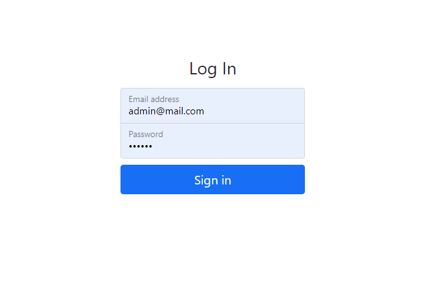
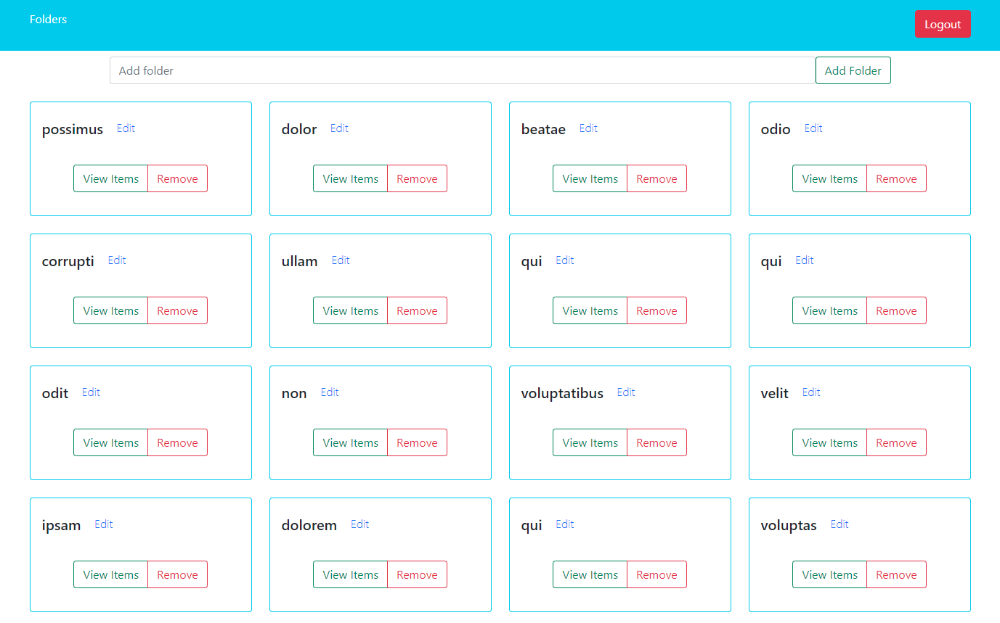
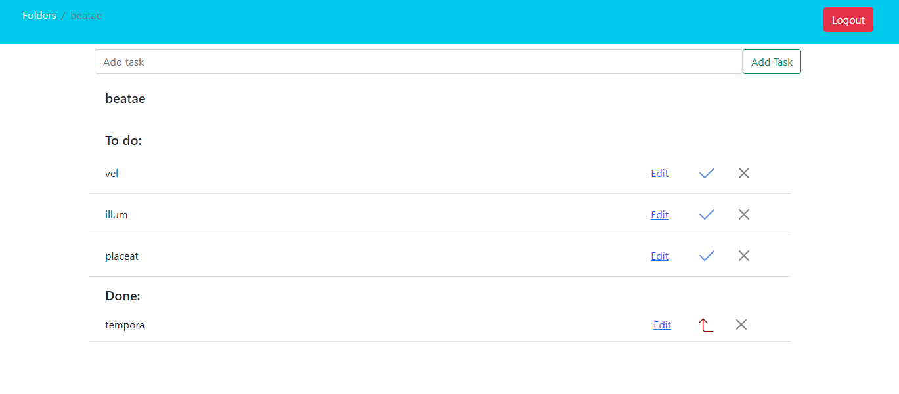

## Screenshots





## To-Do List App

Simple to do list application that allows you to create, edit and delete to-do items. The items are contained in folders which you can create, edit and delete too. <br>
First, it has a login page to authenticate the users. It does not have yet the function to create users from the app but it could be implemented. <br>
The passwords in the database are encrypted.

## Run the application

You have to have the database created 'to-do-list-nodejs-angular' in MySQL and you have to replace the user and password in the .env file.<br>

Then in the project directory, you can run:
### `npm run dev`

It will create all the tables needed in the database, generate some records with content generated randomly, install all the dependencies needed, serve the backend in the default port [http://localhost:3000/](http://localhost:3000/), and the frontend in [http://localhost:4200/](http://localhost:4200/).

The page will reload if you make edits in the app.<br>

## Default Admin User

The project has a default user created, which is 'admin@mail.com' and the password is '123456'.

## Used Tools & Technologies

```
- NodeJS
- ExpressJS
- JWT
- Sequelize
- MySQL
- Angular 12
- Typescript
- Bootstrap 5

```
